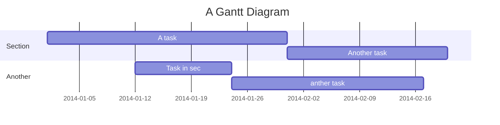

# 2020test
## 2020test
### 2020test
#### 2020test
##### 2020test
###### 2020test


* Item 1
* Item 2
  * Item  2a
  * Item  2b
    * Item  3a
    * Item  3b
    
As Kanye West said:
>We're living the future so

\*literal asterisks\*


- [x] @mentions
- [ ] this is an incomplete

```python
>>> def fib(n):
>>>     a, b = 0, 1
>>>     while a < n:
>>>         print(a, end=' ')
>>>         a, b = b, a+b
>>>     print()
>>> fib(1000)
```
## `Markdown`
```
````

|First|Second|Thirad|
|:-----|:------:|------:|
|cell 1|cell 2|cell 3|
|cell 1|cell 2|cell 3|
|cell 1|cell 2|cell 3|

:+1:
:sparkles:


### Mermaid

[更多關於 **mermaid** 語法 <i class="fa fa-external-link"></i>](http://mermaid-js.github.io/mermaid)
&nbsp;
&nbsp;


---
